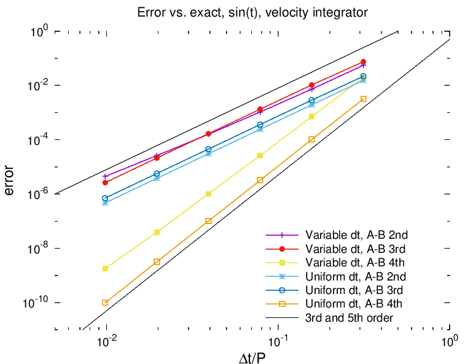

# variableDt
Test program for Adams Bashforth integrator with variable time stepping

## Build and run
This program needs C++20 for `std::numbers::pi_v`, so you can use GCC 10+, Clang 11+, MSVC STL 19.25+, or Apple Clang 12.0.5.
On my desktop, I can build and run this with

	module load gcc/13.2.0
	make
	./variableDt.bin

## Results
Integrating a cosine curve from 0 to pi, sign sin(t) for velocity. For random time steps, average errors over 1000 runs.

| dt     | nsteps | error at t=pi
|--------|--------|------------------
| 0.25x  | 400    | 2.42235302603e-07
|.25-.5x | 266    | 2.506076118e-06
| 0.5x   | 200    | 1.93785245233e-06
| 0.5-1x | 133    | 1.55209519912e-05
|  1x    | 100    | 1.55018632991e-05
| 1-2x   |  67    | 8.95219785452e-05
|  2x    |  50    | 0.000123984309467
| 2-4x   |  34    | 0.000579527912957
|  4x    |  25    | 0.000990895856874
| 4-8x   |  17    | 0.003884942807

Variable time stepping appears to achieve roughly the same error rate as constant-size
time steps of the same upper bound.
But while the constant-step-size AB2 achieves 3rd order (error drops 8x per 2x reduction in dt),
the variable-dt AB2 only achieves about 2.65th order (6.285x per 2x reduction).

Using AB3, both constant and variable step size methods achieve full 3rd order.

For this problem, AB2 and AB3 are 3rd order while AB4 (and presumaby AB5) are 5th order.
This can't be expected to follow for general systems.

## Acknowledgements
I am thankful to [Marciniak and Jankowska](https://link.springer.com/article/10.1007/s11075-019-00774-y) for writing out the formulae for explicit Adams methods with variable step sizes.
